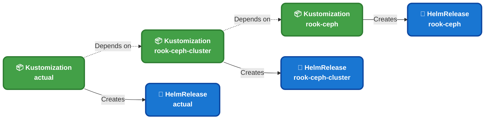

<div align="center">

[](https://discord.gg/home-operations)&nbsp;&nbsp;
[](https://talos.dev)&nbsp;&nbsp;
[](https://kubernetes.io)&nbsp;&nbsp;
[](https://fluxcd.io)&nbsp;&nbsp;
[](https://github.com/nasenov/homelab/actions/workflows/renovate.yaml)

</div>

<div align="center">

[](https://github.com/kashalls/kromgo)&nbsp;&nbsp;
[](https://github.com/kashalls/kromgo)&nbsp;&nbsp;
[](https://github.com/kashalls/kromgo)&nbsp;&nbsp;
[](https://github.com/kashalls/kromgo)&nbsp;&nbsp;
[](https://github.com/kashalls/kromgo)&nbsp;&nbsp;
[](https://github.com/kashalls/kromgo)&nbsp;&nbsp;
[](https://github.com/kashalls/kromgo)&nbsp;&nbsp;
[](https://github.com/kashalls/kromgo)

</div>

---

##  Overview

Welcome to my home infrastructure and Kubernetes cluster repository! This project embraces Infrastructure as Code (IaC) and GitOps principles, leveraging [Kubernetes](https://github.com/kubernetes/kubernetes), [Flux](https://github.com/fluxcd/flux2), [Terraform](https://www.terraform.io/), [Renovate](https://github.com/renovatebot/renovate), and [GitHub Actions](https://github.com/features/actions) to maintain a fully automated, declarative homelab environment.

---

##  Kubernetes

My semi-hyperconverged cluster runs [Talos Linux](https://github.com/siderolabs/talos)-an immutable, minimal Linux distribution purpose-built for Kubernetes-on three bare-metal machines. Storage is handled by [Rook](https://github.com/rook/rook), providing persistent block, object, and file storage directly within the cluster, complemented by a dedicated NAS for media files. The entire cluster is architected for complete reproducibility: I can tear it down and rebuild from scratch without losing any data.

### Core Components

- [cert-manager](https://github.com/cert-manager/cert-manager): Creates TLS certificates for services in my cluster.
- [cilium](https://github.com/cilium/cilium): High-performance container networking powered by [eBPF](https://ebpf.io).
- [cloudflared](https://github.com/cloudflare/cloudflared): Secure tunnel providing Cloudflare-protected access to cluster services.
- [envoy-gateway](https://github.com/envoyproxy/gateway): Modern ingress controller for cluster traffic management.
- [external-dns](https://github.com/kubernetes-sigs/external-dns): Automated DNS record synchronization for ingress resources.
- [external-secrets](https://github.com/external-secrets/external-secrets): Kubernetes secrets management integrated with [Bitwarden](https://bitwarden.com/).
- [rook](https://github.com/rook/rook): Cloud-native distributed storage orchestrator for persistent storage.
- [spegel](https://github.com/spegel-org/spegel): Stateless cluster local OCI registry mirror.
- [volsync](https://github.com/backube/volsync): Backup and recovery of persistent volume claims.

### GitOps

[Flux](https://github.com/fluxcd/flux2) continuously monitors the [kubernetes](./kubernetes) folder and reconciles my cluster state with whatever is defined in this Git repository-Git is the single source of truth.

Here's how it works: Flux recursively scans the [kubernetes/apps](./kubernetes/apps) directory, discovering the top-level `kustomization.yaml` in each subdirectory. These files typically define a namespace and one or more Flux `Kustomization` resources (`ks.yaml`). Each Flux `Kustomization` then manages a `HelmRelease` or other Kubernetes resources for that application.

Meanwhile, [Renovate](https://github.com/renovatebot/renovate) continuously scans the **entire** repository for dependency updates, automatically opening pull requests when new versions are available. Once merged, Flux picks up the changes and updates the cluster automatically.

### Directories

This Git repository contains the following directories under [Kubernetes](./kubernetes/).

```sh
📁 kubernetes
├── 📁 apps       # applications
├── 📁 components # re-useable kustomize components
└── 📁 cluster    # flux system configuration
```

### Cluster layout

Here's how Flux orchestrates application deployments with dependencies. Most applications are deployed as `HelmRelease` resources that depend on other `HelmRelease`'s, while some `Kustomization`'s depend on other `Kustomization`'s. Occasionally, an application may have dependencies on both types. The diagram below illustrates this: `actual` won't deploy or upgrade until `rook-ceph-cluster` is successfully installed and healthy.

<details>
  <summary>Click to see a high-level architecture diagram</summary>


</details>

---

##  Cloud Dependencies

While most of my infrastructure and workloads are self-hosted I do rely upon the cloud for certain key parts of my setup.

| Service                                      | Use                                                           | Cost          |
|----------------------------------------------|---------------------------------------------------------------|---------------|
| [Bitwarden](https://bitwarden.com/)          | Secrets with [External Secrets](https://external-secrets.io/) | Free          |
| [Cloudflare](https://cloudflare.com/)        | Domain, S3 and Tunnel                                         | ~$12/yr       |
| [Discord](https://discord.com/)              | Alerts and Notifications                                      | Free          |
| [Github](https://github.com/)                | Github Actions                                                | Free          |
| [Let's Encrypt](https://letsencrypt.org/)    | TLS certificates                                              | Free          |
|                                              |                                                               | Total: ~$1/mo |

---

##  DNS

I run two instances of [ExternalDNS](https://github.com/kubernetes-sigs/external-dns) to handle DNS automation:

- **Private DNS**: Syncs records to my `Pi-hole`
- **Public DNS**: Syncs records to `Cloudflare`

This is achieved by defining routes with two specific gateways: `internal` for private DNS and `external` for public DNS. Each ExternalDNS instance watches for routes using its assigned gateway and syncs the appropriate DNS records to the corresponding platform.

---

##  Hardware

| Device                | Num | OS Disk Size | Data Disk Size                                   | RAM   | OS      | Function         |
|-----------------------|-----|--------------|--------------------------------------------------|-------|---------|------------------|
| Lenovo m910x i5-7500  | 3   | 256GB NVMe   | 500GB SSD (local) / 1TB NVMe (rook-ceph)         | 16GB  | Talos   | Kubernetes       |
| Aoostar WTR PRO 5825U | 1   | 256GB NVMe   | 2x2TB SSD                                        | 16GB  | TrueNAS | NAS              |
| TP-Link Archer AX53   | 1   | -            | -                                                | -     | -       | Router           |
